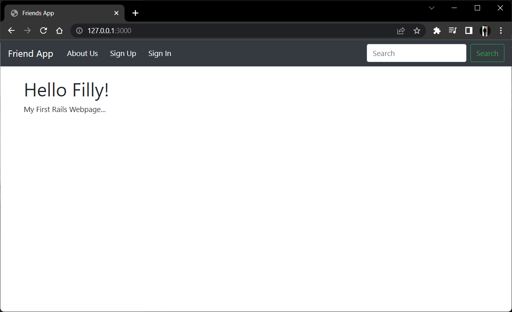
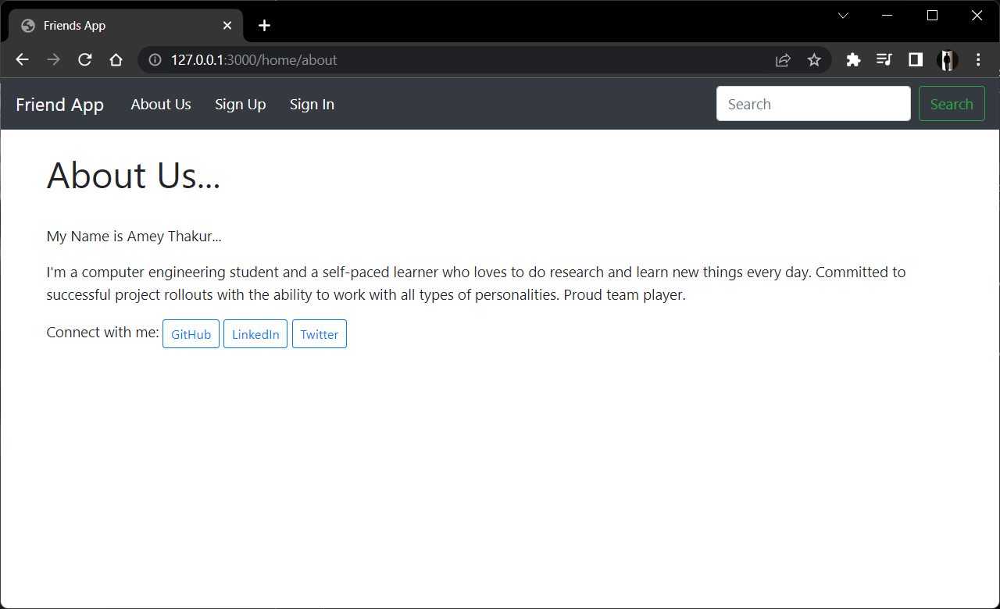
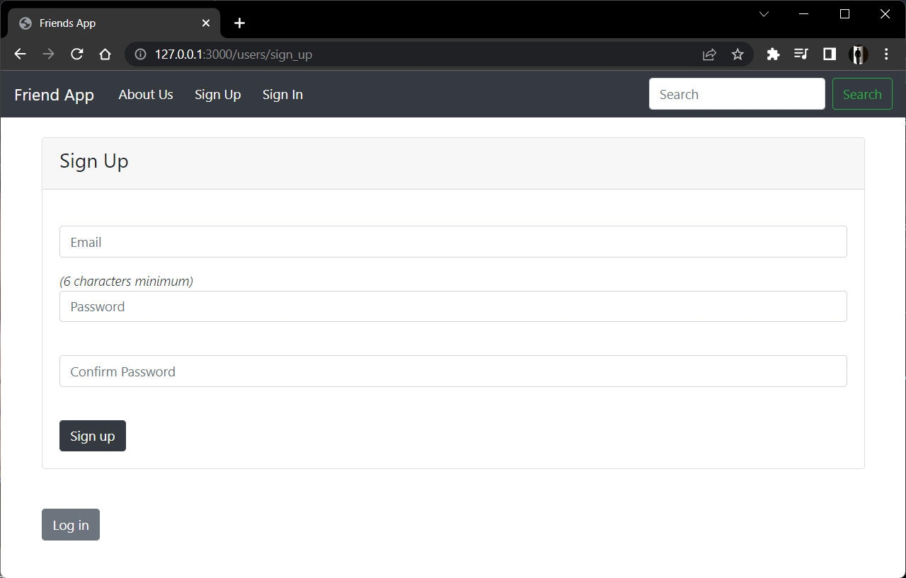
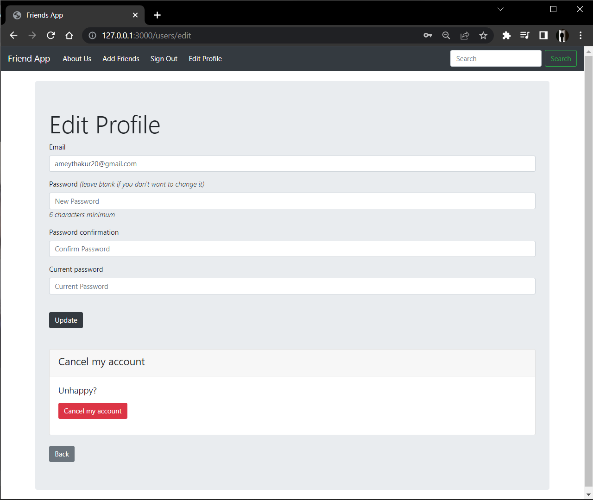
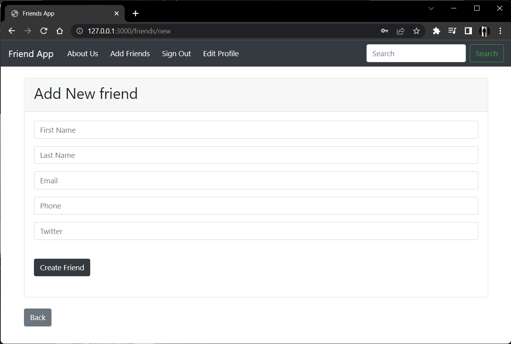
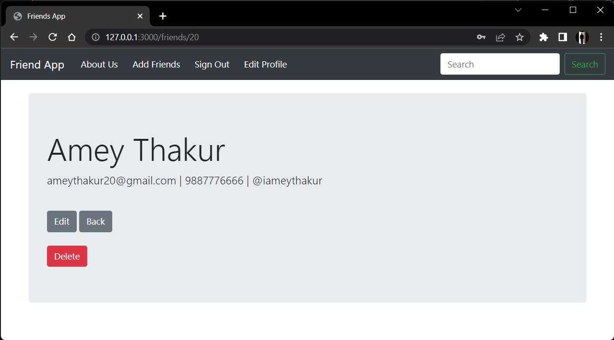
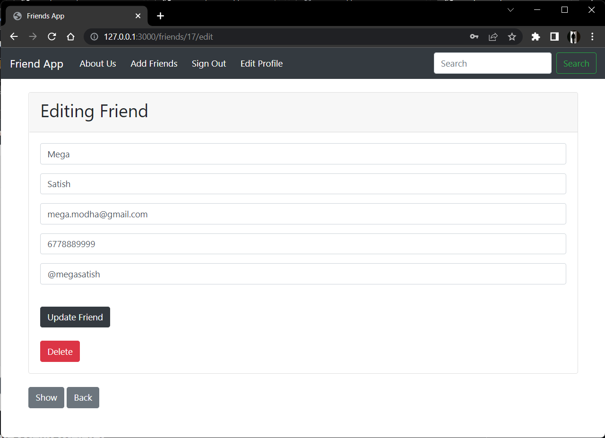
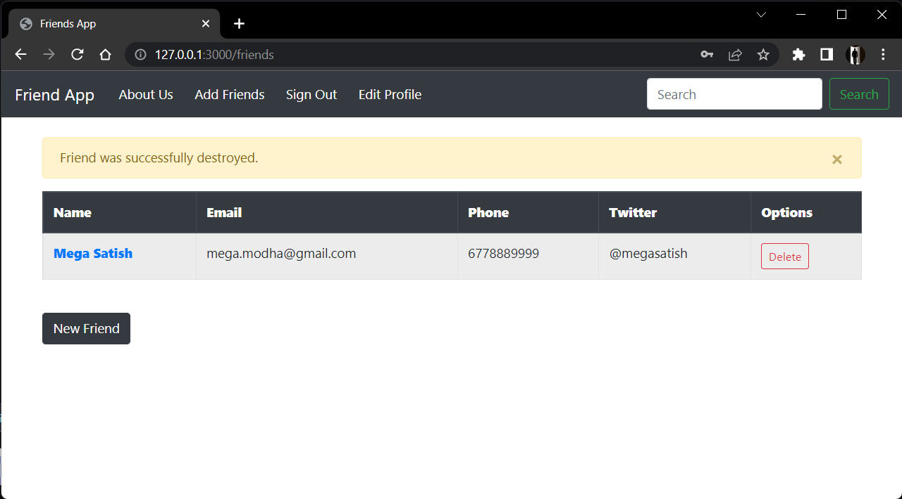
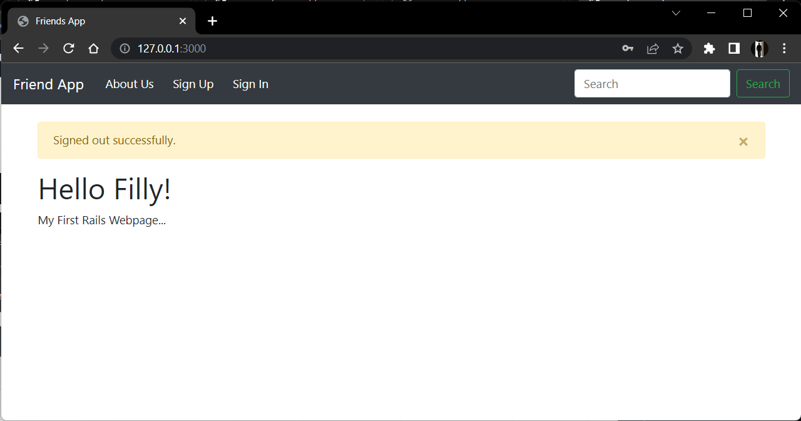

<div align="center">

  <a name="readme-top"></a>
  # <a href="https://amey-thakur.github.io/RUBY/"></a> <br> RailsFriends

  [](LICENSE)
  
  [](https://rubyonrails.org/)
  [](https://github.com/Amey-Thakur/RAILSFRIENDS)

  A high-fidelity, modular web-based Contact Management System engineered in Ruby on Rails, demonstrating strict adherence to Model-View-Controller (MVC) principles and responsive User Interface (UI) design within a browser environment.

  **[Source Code](Source%20Code/)** &nbsp;·&nbsp; **[Technical Specification](docs/SPECIFICATION.md)** &nbsp;·&nbsp; **[Live Demo](https://railsfriends-djxy.onrender.com/)**

</div>

---

<div align="center">

  [Authors](#authors) &nbsp;·&nbsp; [Overview](#overview) &nbsp;·&nbsp; [Features](#features) &nbsp;·&nbsp; [Structure](#project-structure) &nbsp;·&nbsp; [Results](#results) &nbsp;·&nbsp; [Quick Start](#quick-start) &nbsp;·&nbsp; [Usage Guidelines](#usage-guidelines) &nbsp;·&nbsp; [License](#license) &nbsp;·&nbsp; [About](#about-this-repository) &nbsp;·&nbsp; [Acknowledgments](#acknowledgments)

</div>

---

<!-- AUTHORS -->
<div align="center">

  <a name="authors"></a>
  ## Authors

| <a href="https://github.com/Amey-Thakur"></a><br>[**Amey Thakur**](https://github.com/Amey-Thakur)<br><br>[](https://orcid.org/0000-0001-5644-1575) | <a href="https://github.com/msatmod"></a><br>[**Mega Satish**](https://github.com/msatmod)<br><br>[](https://orcid.org/0000-0002-1844-9557) |
| :---: | :---: |

</div>

> [!IMPORTANT]
> ### 🤝🏻 Special Acknowledgement
> *Special thanks to **[Mega Satish](https://github.com/msatmod)** for her meaningful contributions, guidance, and support that helped shape this work.*

---

<!-- OVERVIEW -->
<a name="overview"></a>
## Overview

**RailsFriends** is a robust interactive system engineered to demonstrate the elegance and efficiency of Ruby on Rails' Model-View-Controller architecture. By bridging the gap between foundational algorithms and modern web development, this repository provides a comprehensive study into systematic software engineering and logical state orchestration.

The application serves as a digital exploration of CRUD operations and responsive web interaction, structured into modular components that ensure maintainability and high-performance execution directly within the browser environment.
<br><br>
This project was developed as a distinctive milestone during the **[30-Day Ruby Challenge](https://amey-thakur.github.io/RUBY/)**, a collaborative engineering sprint undertaken by **Amey Thakur** and **Mega Satish**. It represents the practical synthesis of concepts explored in the comprehensive **[Ruby Repository](https://github.com/Amey-Thakur/RUBY)**, demonstrating the transition from theoretical study to production-grade implementation. It marks a significant achievement as the **First Ruby on Rails Project** in this learning journey.

### Engineering Heuristics
The interaction model is governed by strict **computational design patterns** ensuring fidelity and responsiveness:
*   **Modular Orchestration**: The system utilizes a specialized architecture (Controllers, Models, Views) for complex logic separation, providing a tactile confirmation for every user action.
*   **State Integrity**: Beyond simple storage, the system integrates a validation engine (ActiveRecord) that dynamically verifies every input, reinforcing the deterministic narrative of the data flow.
*   **Responsive Feedback**: Real-time Bootstrap rendering ensures the interface remains synchronized, maintaining a zero-latency bridge between raw user input and visual updates.

> [!TIP]
> **Logic-Driven Interaction**
>
> To maximize user engagement, the system employs a **multi-stage validation system**. **Visual flash messages** visualize the current state, and **deterministic controllers** provide immediate feedback, strictly coupling user goals with state changes. This ensures the user's mental model is constantly synchronized with the underlying application trajectory.

---

<!-- FEATURES -->
<a name="features"></a>
## Features

| Feature | Description |
|---------|-------------|
| **Tactile Interaction** | Implements **Real-Time Visual Feedback** for intuitive and high-impact user actions. |
| **Modular MVC** | Custom **Model-View-Controller Architecture** ensuring clean separation of data and logic. |
| **Logic Verification** | Robust **Active-Record Validation** ensuring mission data survives invalid input events. |
| **Secure Authentication** | A deterministic **Devise Authentication Sequence** that ensures assets are protected before interaction. |
| **Dynamic CRUD** | Integrated **Resource Orchestration Engine** for visual and structural data management. |
| **Responsive UI** | **High-Fidelity Bootstrap Scanners** that adapt layout to viewing device milestones. |
| **Zero-Latency Runtime** | Deployed via **Heroku/Render** with **Puma-based non-blocking I/O** for a native feel in the browser. |
| **Structural Clarity** | In-depth and detailed comments integrated throughout the codebase for transparent logic study. |

> [!NOTE]
> ### Interactive Polish: The Visual Corridor
> We have engineered a **Logic-Driven Display Manager** (Bootstrap 5) that calibrates layout consistency across multiple vectors to simulate professional web environments. The visual language focuses on the minimalist "Visual Corridor" aesthetic, ensuring maximum focus on the interactive strategy trajectory.

### Tech Stack
- **Language**: Ruby 3.x
- **Framework**: **Ruby on Rails 7.x**
- **Database**: **SQLite3** (Dev) / **PostgreSQL** (Prod)
- **Frontend**: **Bootstrap 5** via Importmaps
- **Authentication**: **Devise** Gem
- **Testing**: **Minitest** (System & Integration)
- **Code Quality**: **RuboCop** (Static Code Analysis)
- **Tooling**: Built for Web Environments

---

<!-- STRUCTURE -->
<a name="project-structure"></a>
## Project Structure

```python
RAILSFRIENDS/
│
├── docs/                            # Project Documentation
│   ├── Rails_Logo.png               # Branding Asset
│   └── SPECIFICATION.md             # Technical Architecture
│
├── Mega/                            # Attribution Assets
│   ├── Filly.jpg                    # Companion (Filly)
│   ├── Mega.png                     # Profile Image (Mega Satish)
│   └── ...                          # Additional Media
│
├── screenshots/                     # Documentation Assets
│   ├── 01_home_page.png             # UI Screenshot
│   └── ...                          # Visual Evidence
│
├── Source Code/                     # Primary Application Layer
│   ├── app/                         # Core Logic
│   │   ├── controllers/             # Action Dispatchers
│   │   ├── models/                  # Data Logic
│   │   └── views/                   # UI Templates
│   ├── config/                      # Environment Configuration
│   ├── db/                          # Database Schema
│   ├── test/                        # Verification Layer
│   ├── Gemfile                      # Dependency Definitions
│   └── Gemfile.lock                 # Dependency Lockfile
│
├── SECURITY.md                      # Security Protocols
├── CITATION.cff                     # Project Citation Manifest
├── codemeta.json                    # Metadata Standard
├── LICENSE                          # MIT License
└── README.md                        # Project Entrance
```

---

<a name="results"></a>
## Results

<div align="center">
  <b>Home Page</b>
  <br>
  <i>Landing page of the RailsFriends application.</i>
  <br><br>
  
  <br><br><br>

  <b>About Us</b>
  <br>
  <i>Information about the project and team.</i>
  <br><br>
  
  <br><br><br>

  <b>Sign Up</b>
  <br>
  <i>User registration interface.</i>
  <br><br>
  
  <br><br><br>

  <b>Sign In</b>
  <br>
  <i>Secure authentication login.</i>
  <br><br>
  
  <br><br><br>

  <b>Edit Profile</b>
  <br>
  <i>User account management settings.</i>
  <br><br>
  
  <br><br><br>

  <b>Add Friend (Create)</b>
  <br>
  <i>Interface for adding new contacts.</i>
  <br><br>
  
  <br><br><br>

  <b>Show Friend (Read)</b>
  <br>
  <i>Detailed view of a contact (Top Section).</i>
  <br><br>
  
  <br><br>
  <i>Detailed view of a contact (Bottom Section).</i>
  <br><br>
  
  <br><br><br>

  <b>Update Friend (Update)</b>
  <br>
  <i>Form for editing contact details.</i>
  <br><br>
  
  <br><br><br>

  <b>Delete Friend (Delete)</b>
  <br>
  <i>Confirmation modal for removing a contact.</i>
  <br><br>
  
  <br><br><br>

  <b>Friends List</b>
  <br>
  <i>Comprehensive dashboard of all saved contacts.</i>
  <br><br>
  
  <br><br><br>

  <b>Sign Out</b>
  <br>
  <i>Successful logout confirmation flash message.</i>
  <br><br>
  
</div>

---

<!-- QUICK START -->
<a name="quick-start"></a>
## Quick Start

### 1. Prerequisites
- **Ruby 3.3+**: Required for runtime execution. [Download Ruby](https://www.ruby-lang.org/)
- **Bundler**: For managing gem dependencies. (`gem install bundler`)
- **Git**: For version control and cloning. [Download Git](https://git-scm.com/downloads)
- **Node.js**: Optional, for advanced asset compilation.

> [!WARNING]
> **Runtime Environment Isolation**
>
> The application is designed for modern web browsers. Ensure your browser supports **ES6 Modules** if you wish to see the full fidelity of the responsive interactions.

### 2. Installation & Setup

#### Step 1: Clone the Repository
Open your terminal and clone the repository:
```bash
git clone https://github.com/Amey-Thakur/RAILSFRIENDS.git
cd RAILSFRIENDS/Source\ Code
```

#### Step 2: Install Dependencies
Install the required gems (Rails, Devise, Bootstrap) defined in the `Gemfile`:
```bash
bundle install
```

#### Step 3: Database Migration
Initialize and migrate the database:
```bash
rails db:migrate
```

### 3. Execution

#### Start the Server
Launch the primary Rails server loop:
```bash
rails server
```
Access the application at `http://localhost:3000`.

#### Run Tests
Verify the system integrity using Minitest:
```bash
rails test
```

> [!TIP]
> **Instant Play**
>
> You can interact with the app instantly in your browser without any installation via our Cloud deployment:
>
> 👉🏻 **[Launch RailsFriends Live](https://railsfriends-djxy.onrender.com/)**

---

<!-- USAGE GUIDELINES -->
<a name="usage-guidelines"></a>
## Usage Guidelines

This repository is openly shared to support learning and knowledge exchange across the engineering community.

**For Students**  
Use this project as reference material for understanding **Ruby on Rails MVC Architecture**, **Web Input/Output Handling**, and **Modular Logic Separation**. The source code is available for study to facilitate self-paced learning and exploration of **classic web patterns and UI design principles**.

**For Educators**  
This project may serve as a practical lab example or supplementary teaching resource for **Web Development**, **Object-Oriented Design**, and **Full-Stack Engineering** courses. Attribution is appreciated when utilizing content.

**For Researchers**  
The documentation and architectural approach may provide insights into **systematic project structuring**, **Rails-based logic verification**, and **visual feedback loops in web-based software**.

---

<!-- LICENSE -->
<a name="license"></a>
## License

This repository and all its creative and technical assets are made available under the **MIT License**. See the [LICENSE](LICENSE) file for complete terms.

> [!NOTE]
> **Summary**: You are free to share and adapt this content for any purpose, even commercially, as long as you provide appropriate attribution to the original authors.

Copyright © 2022 Amey Thakur & Mega Satish

---

<!-- ABOUT -->
<a name="about-this-repository"></a>
## About This Repository

**Created & Maintained by**: [Amey Thakur](https://github.com/Amey-Thakur) & [Mega Satish](https://github.com/msatmod)

This project features **RailsFriends**, a logic-driven interactive contact management system. It represents a personal exploration into **Rails**-based class orchestration and high-performance web design. It was developed as a key project within the **[30-Day Ruby Challenge](https://amey-thakur.github.io/RUBY/)**, marking a significant step in the mastery of the framework as our **First Ruby on Rails Project**.

> [!IMPORTANT]
> ### 🏛️ Original Deployment Archive
> The application was originally deployed on **[Heroku](https://rubyonrailsfriendwebapp.herokuapp.com/)** by **[Mega Satish](https://github.com/msatmod)**, serving as a live demonstration of the production capabilities.
>
> 👉🏻 **[Heroku Deployment Link](https://rubyonrailsfriendwebapp.herokuapp.com/)**
>
> **Note**: Due to Heroku's discontinuation of their free tier services, the active live deployment has been migrated to **Render**. The original link is preserved here for historical context and authenticity of the initial launch.

**Connect:** [GitHub](https://github.com/Amey-Thakur) &nbsp;·&nbsp; [LinkedIn](https://www.linkedin.com/in/amey-thakur) &nbsp;·&nbsp; [ORCID](https://orcid.org/0000-0001-5644-1575)

### Acknowledgments

Grateful acknowledgment to [**Mega Satish**](https://github.com/msatmod) for her exceptional collaboration and partnership during the development of this RailsFriends project. Her constant support, technical clarity, and dedication to software quality were instrumental in achieving the system's functional objectives. Learning alongside her was a transformative experience; her thoughtful approach to problem-solving and steady encouragement turned complex requirements into meaningful learning moments. This work reflects the growth and insights gained from our side-by-side journey. Thank you, Mega, for everything you shared and taught along the way.

Special thanks to the **mentors and peers** whose encouragement, discussions, and support contributed meaningfully to this learning experience.

---

<div align="center">

  [↑ Back to Top](#readme-top)

  [Authors](#authors) &nbsp;·&nbsp; [Overview](#overview) &nbsp;·&nbsp; [Features](#features) &nbsp;·&nbsp; [Structure](#project-structure) &nbsp;·&nbsp; [Results](#results) &nbsp;·&nbsp; [Quick Start](#quick-start) &nbsp;·&nbsp; [Usage Guidelines](#usage-guidelines) &nbsp;·&nbsp; [License](#license) &nbsp;·&nbsp; [About](#about-this-repository) &nbsp;·&nbsp; [Acknowledgments](#acknowledgments)

  <br>

  <a href="https://amey-thakur.github.io/RUBY/"></a> **[RailsFriends App](https://railsfriends-djxy.onrender.com/)**

  ---

  ### 🎓 [Computer Engineering Repository](https://github.com/Amey-Thakur/COMPUTER-ENGINEERING)

  **Computer Engineering (B.E.) - University of Mumbai**

  *Semester-wise curriculum, laboratories, projects, and academic notes.*

</div>
