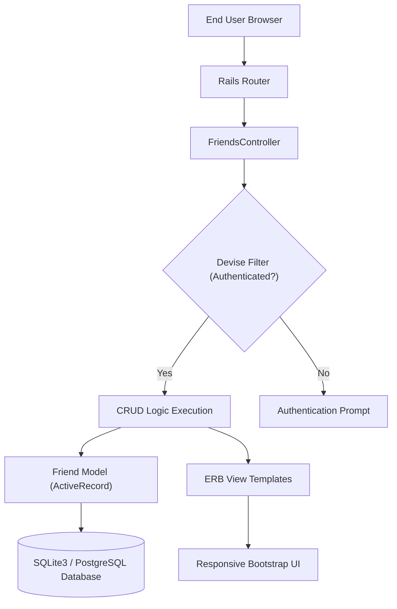

# Technical Specification: RAILSFRIENDS

## Architectural Overview

**RAILSFRIENDS** is a production-grade, modular web application engineered to demonstrate the efficiency and elegance of the **Ruby on Rails** Model-View-Controller (MVC) architecture. The project serves as a comprehensive implementation of fundamental full-stack engineering principles, including relational state management, secure user authentication, and responsive HMI design for the modern web.

### Logic Flow (MVC Orchestration)

---

## Technical Implementations

### 1. Full-Stack Ruby Engine
-   **Framework Architecture**: Built on **Rails 7.x**, utilizing the Model-View-Controller (MVC) pattern for strict separation of concerns and high-performance routing.
-   **State Management**: Optimized for **PostgreSQL** in production and **SQLite3** for deterministic local development, managed via **ActiveRecord ORM**.

### 2. Specialized Modules & Components
-   **Authentication Layer**: Integrated via **Devise**, providing secure session management, password hashing, and user identity verification.
-   **RESTful CRUD Orchestration**: Implements the full lifecycle of friend data (Create, Read, Update, Delete) with robust input validation and authorization guards.
-   **Interactive UI**: Utilizing the **Bootstrap ecosystem** for high-fidelity, mobile-responsive layout consistency.

### 3. Engineering Quality
-   **Secure Handling**: Features `before_action` authentication filters and `correct_user` authorization logic to ensure data integrity and user privacy.
-   **Dependency Discipline**: Managed via **Bundler**, ensuring a synchronized and reproducible environment across diverse systems.

---

## Technical Prerequisites

-   **Runtime**: Ruby 3.1.2 or higher ([Ruby-lang.org](https://www.ruby-lang.org/)).
-   **Web Framework**: Ruby on Rails 7.0.3.
-   **Gem Management**: Bundler for dependency orchestration.
-   **Database**: SQLite3 (Local) / PostgreSQL (Production).

---

*Technical Specification | RailsFriends Ruby Project | Version 1.0*
